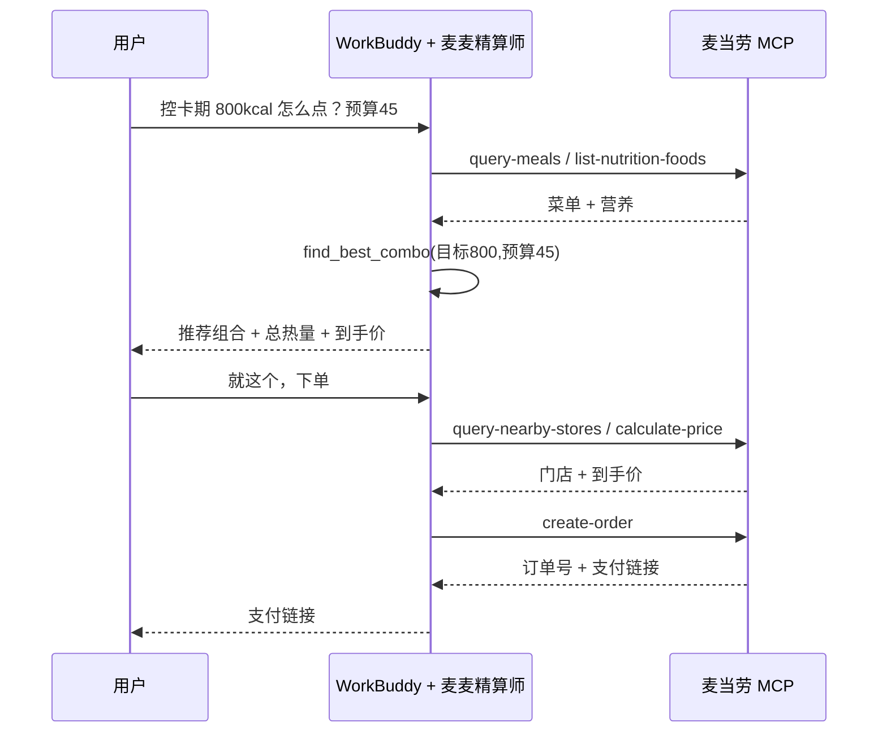

# MCP_INTEGRATION.md — 麦当劳 MCP 接入说明

## 1. 使用的 MCP Server

| 项目 | 值 |
|---|---|
| 提供方 | 麦当劳中国（M-China 官方） |
| 接入地址 | `https://mcp.mcd.cn` |
| 传输协议 | Streamable HTTP（非 WebSocket） |
| 鉴权 | 请求头 `Authorization: Bearer <MCD_MCP_TOKEN>` |
| 协议版本 | MCP 2025-06-18（麦当劳 Server 支持的最高版本） |
| 限流 | 每 Token 600 次/分钟（超 429） |
| 官方指南 | https://github.com/M-China/mcd-mcp-server |

本项目**真实调用**上述 MCP Server：在 WorkBuddy 中作为自定义连接器 `mcd-mcp` 接入；
命令行下由 `src/mcp_client.py`（仅标准库）以 Bearer 鉴权发起 JSON-RPC 请求。

## 2. 实际使用的 Tools（及业务映射）

| MCP Tool | 本项目的用途 | 对应模式 |
|---|---|---|
| `auto-bind-coupons` / `available-coupons` | 一键领券 / 取可领券列表 | 省钱 |
| `query-my-coupons` / `query-store-coupons` | 账户券 / 当前门店可用券 | 省钱 |
| `query-meals` / `query-meal-detail` | 实时菜单、单价、套餐组成 | 全部 |
| `list-nutrition-foods` | 餐品营养（能量/蛋白/脂肪/碳水/钠/钙） | 营养达标 |
| `calculate-price` | 含券后到手价核算 | 下单前校验 |
| `query-my-account` | 积分余额 | 积分策略 |
| `mall-points-products` / `mall-product-detail` | 积分商城可兑项及价值 | 积分策略 |
| `query-nearby-stores` / `delivery-query-stores` | 附近/可配送门店 | 下单 |
| `delivery-query-addresses` / `delivery-create-address` | 配送地址管理 | 外送 |
| `create-order` / `query-order` | 创建订单 / 查询进度 | 下单 |
| `mall-create-order` / `mall-create-order-physical` | 积分兑券 / 兑实物 | 积分兑换 |
| `campaign-calendar` | 当月营销活动（推荐参考） | 推荐 |
| `now-time-info` | 时间上下文 | 全部 |

## 3. 调用流程（以「营养达标 + 下单」为例）

## 4. 优化引擎与 MCP 的分工

- **MCP**：负责「取数」与「执行」（菜单、营养、券、积分、门店、下单）。
- **src/optimizer.py**：负责「决策」（纯算法，可单测）：
  - `apply_coupons`：给定清单自动选最优券（单品券取特价、订单券取满减/折扣最优）。
  - `find_best_combo`：预算内枚举「每类至多 1 件」组合，按热量贴合 + 蛋白 + 价格打分取最优。
  - `rank_points_redeem`：按「每千积分价值」排序积分兑换建议。

## 5. 业务价值

1. **省钱**：自动领券 + 比价，把人工蹲券变成一次对话。
2. **健康**：把「想吃麦当劳又怕胖」变成可量化的热量/蛋白目标搭配。
3. **积分最大化**：用「每千积分价值」替代拍脑袋，明确「换什么最值 / 何时不如直接买」。
4. **决策透明**：每一步都给出到手价与依据，下单前强制确认，体验可控。

## 6. 合规

- Token 仅以环境变量 `${MCD_MCP_TOKEN}` 注入，不落盘、不提交（见 `.gitignore`、CONTEST_DECLARATION.md）。
- 仅向官方 `https://mcp.mcd.cn` 发起请求，不访问任何第三方站点。
- 营养/健康相关输出均标注「仅供参考，非专业建议」。
