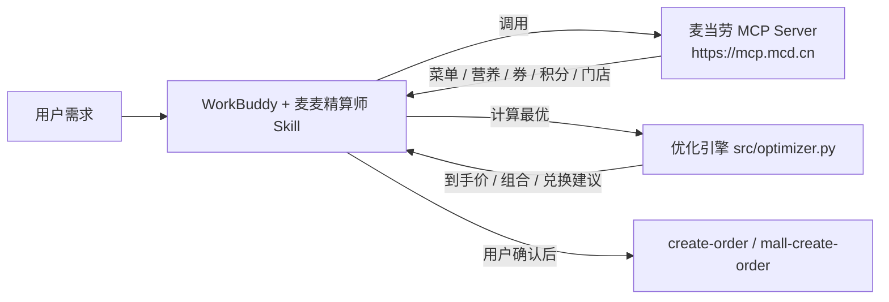

<p align="center">
  
  
  
  
</p>

<h1 align="center">🍔 麦麦精算师 · McDonald's Smart Order Optimizer</h1>

<p align="center">
  <b>基于麦当劳 MCP 的智能点餐优化技能</b> —— 自动领券、实时菜单、营养数据、多目标优化，<br/>
  一句话算出「预算内最省 / 热量达标 / 蛋白更高」的<u>最优组合</u>与<u>到手价</u>，确认后再下单。
</p>

---

## 这是什么

麦当劳 MCP 已经能查菜单、领券、算价、下单，但它把「原材料」直接丢给用户。
**麦麦精算师** 在 MCP 之上加了一个「会算账、懂营养」的决策层：

- 💰 **省钱模式**：给想买的清单，自动选最优券（单品特价 + 满减/折扣），算出到手价
- 🥗 **营养达标**：给热量/蛋白目标 + 预算，枚举搭配、按「热量贴合 + 蛋白 + 价格」打分取最优
- 🎟️ **积分策略**：给积分余额，按「每千积分价值」排序，告诉你换什么最值、何时不如直接买
- 🛒 **一键下单**：确认金额与内容后，调用 `create-order` 生成支付链接

> 不是「帮你点个餐」，而是「帮你把每一次麦当劳点餐都点到最优」。

## 为什么不一样（区别于普通「点餐助手」）

| 普通助手 | 麦麦精算师 |
|---|---|
| 把菜单/券罗列给你自己挑 | 多目标优化引擎直接算**最优解** |
| 只算不算「健不健康」 | 内置营养数据，按热量/蛋白目标搭配 |
| 积分兑换凭感觉 | 用「每千积分价值」量化，**换什么最值**一目了然 |
| 无 Token 就跑不起来 | **dry-run 模式内置样例数据，零门槛体验算法** |

## 架构



## 快速开始

### 方式一：作为 WorkBuddy 技能安装（推荐，可拿联动积分）

1. 把本仓库 `SKILL.md` 与 `src/` 放入 WorkBuddy 技能目录（用户级或项目级）。
2. 在 WorkBuddy【连接器】配置麦当劳 MCP（见 `SKILL.md` 前置条件，`mcp-config.example.json` 为脱敏模板）：
   ```json
   {
     "mcpServers": {
       "mcd-mcp": {
         "type": "streamablehttp",
         "url": "https://mcp.mcd.cn",
         "headers": { "Authorization": "Bearer ${MCD_MCP_TOKEN}" }
       }
     }
   }
   ```
3. 对话里直接说：「帮我把这顿麦当劳点到最便宜」「控卡期 800 大卡怎么点最划算」。

### 方式二：命令行独立运行（无需 WorkBuddy，无需 Token）

```bash
# 省钱：想买 麦辣鸡腿堡 + 可乐(中)
python -m src.cli save --items mcrib,coke_m

# 营养达标：目标 800 kcal，预算 45 元
python -m src.cli nutrition --kcal 800 --budget 45

# 积分策略：余额 5000
python -m src.cli points --balance 5000

# 验证真实 MCP 连接（需设置环境变量 MCD_MCP_TOKEN）
export MCD_MCP_TOKEN=你的令牌
python -m src.cli live
```

> 默认 dry-run 使用 `src/mock_data.py` 样例数据，方便无令牌直接体验算法。

### 运行测试

```bash
python tests/test_optimizer.py     # 8 项断言，零依赖
```

## 示例输出

```
== 省钱模式 ==
  - 麦辣鸡腿堡 (mcrib)
  - 可乐(中) (coke_m)
  小计      : ¥16.00
  单品券省  : ¥15.00
  >>> 到手价: ¥16.00
  已用券    : 麦辣鸡腿堡特价¥10, 可乐(中)特价¥6

== 营养达标 800kcal / 预算45 ==
  推荐组合(共 2 件):
    - 麦辣鸡腿堡: 517 kcal, 蛋白 25g, ¥21
    - 麦乐鸡(6块): 296 kcal, 蛋白 16g, ¥18
  总热量 : 813 kcal (目标 800)   总蛋白 : 41 g   >>> 到手价: ¥39.00

== 积分策略 余额5000 ==
  - 巨无霸兑换券: 2000分≈¥24 | 每千积分价值¥12.0 | 可兑
  - 麦辣鸡腿堡兑换券: 1800分≈¥21 | 每千积分价值¥11.7 | 可兑
  - 薯条(中)兑换券: 1200分≈¥12 | 每千积分价值¥10.0 | 可兑
```

## 项目结构

```
mcd-smart-order-optimizer/
├── README.md                 # 项目介绍（必交）
├── CONTEST_DECLARATION.md    # 参赛声明，原样（必交）
├── MCP_INTEGRATION.md        # MCP 接入说明（必交）
├── mcp-config.example.json   # 脱敏 MCP 配置（必交）
├── workbuddy.md              # WorkBuddy 开发上下文（拿 WB 专项积分必交）
├── SKILL.md                  # WorkBuddy 技能本体（可安装）
├── demo.py                   # 一站式演示
├── src/
│   ├── optimizer.py          # 核心优化引擎（纯算法，可单测）
│   ├── mcp_client.py         # 麦当劳 MCP Streamable HTTP 客户端（仅标准库）
│   ├── mock_data.py          # dry-run 样例数据
│   └── cli.py                # 命令行入口
├── references/tools.md       # 麦当劳 MCP 工具清单
└── tests/test_optimizer.py   # 单元测试（8 项）
```

## 优化引擎核心公式

- **用券**：单品取「菜单价 vs 最优适用单品券特价」较小值；再叠加一张最优「满减/折扣」订单券。
- **营养搭配打分**：`score = 蛋白×0.3 − |热量−目标|/5 − 价格×0.1`
  （热量贴合为第一优先级，其次蛋白，最后价格；组合内同类不重复）。
- **积分兑换**：`每千积分价值 = 市场价 / 积分 × 1000`，降序推荐可兑项。

## 合规与安全

- Token 仅以环境变量注入，不落盘、不提交（见 `.gitignore`、CONTEST_DECLARATION.md）。
- 仅向官方 `https://mcp.mcd.cn` 发起请求。
- 营养/健康输出均标注「仅供参考，非专业建议」。
- 写操作（`create-order` 等）必须先确认再执行。

## 声明

参赛作品，由作者独立开发，非麦当劳官方产品。餐品信息、价格及供应状态以麦当劳官方渠道实时结果为准。

## License

MIT
