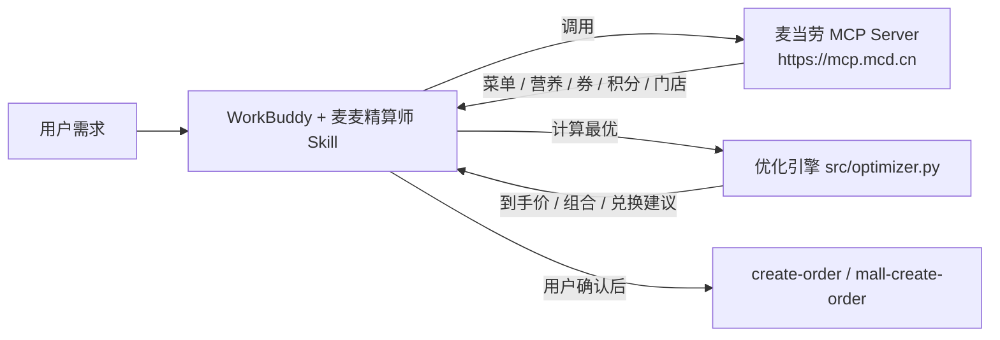

<p align="center">
  
  
  
  
</p>

<h1 align="center">🍔 麦麦精算师 · McDonald's Smart Order Optimizer</h1>

<p align="center">
  <b>基于麦当劳 MCP 的智能点餐优化技能</b> —— 自动领券、实时菜单、营养数据、多目标优化，<br/>
  一句话算出「预算内最省 / 热量达标 / 蛋白更高」的<u>最优组合</u>与<u>到手价</u>，确认后再下单。
</p>

<p align="center">
  <b>🏆 2026 麦当劳程序员创意开发大赛参赛作品</b> · Star 榜 10/26 00:00 截止，<a href="https://github.com/xxxxxxxxxxxxXxXxXxa/mcd-smart-order-optimizer">来捧个场 ⭐</a>
</p>

---

## 这是什么

麦当劳 MCP 已经能查菜单、领券、算价、下单，但它把「原材料」直接丢给用户。
**麦麦精算师** 在 MCP 之上加了一个「会算账、懂营养」的决策层：

- 💰 **省钱模式**：给想买的清单，自动选最优券（单品特价 + 满减/折扣），算出到手价
- 🥗 **营养达标**：给热量/蛋白目标 + 预算，枚举搭配、按「热量贴合 + 蛋白 + 价格」打分取最优
- 🎟️ **积分策略**：给积分余额，按「每千积分价值」排序，告诉你换什么最值、何时不如直接买
- 🍱 **套餐拆解**：同一份清单并行对比「单品直购 / 官方套餐 / 1+1随心配」，选最省的那条路
- 📊 **性价比榜**：按「每元蛋白 / 每元热量 / 综合性价比」给餐品排名，谁最划算一目了然
- 🚫 **忌口过滤**：素食 / 过敏原 / 限钠，先过滤菜单再优化
- 🗓️ **券包排程**：多张带到期日的券，算「哪张用在哪个订单」最省，快过期的先用不浪费
- 📅 **多天计划**：一周饮食规划，控热量与预算、尽量不重样
- 📄 **分享报告**：一键生成单文件 HTML（内联 SVG 图表，无外链），可直接晒
- ⏰ **预订单 / 定时点单**：到点自动重新核价 + 安全闸门（在售 / 预算上限），弹待确认卡片，确认后才下单
- 🛒 **一键下单**：确认金额与内容后，调用 `create-order` 生成支付链接

> 不是「帮你点个餐」，而是「帮你把每一次麦当劳点餐都点到最优」。

## 为什么不一样（区别于普通「点餐助手」）

| 普通助手 | 麦麦精算师 |
|---|---|
| 把菜单/券罗列给你自己挑 | 多目标优化引擎直接算**最优解** |
| 只算不算「健不健康」 | 内置营养数据，按热量/蛋白目标搭配 |
| 积分兑换凭感觉 | 用「每千积分价值」量化，**换什么最值**一目了然 |
| 无 Token 就跑不起来 | **dry-run 模式内置样例数据，零门槛体验算法** |

## 架构



## 快速开始

### 方式一：作为 WorkBuddy 技能安装（推荐，可拿联动积分）

1. 把本仓库 `SKILL.md` 与 `src/` 放入 WorkBuddy 技能目录（用户级或项目级）。
2. 在 WorkBuddy【连接器】配置麦当劳 MCP（见 `SKILL.md` 前置条件，`mcp-config.example.json` 为脱敏模板）：
   ```json
   {
     "mcpServers": {
       "mcd-mcp": {
         "type": "streamablehttp",
         "url": "https://mcp.mcd.cn",
         "headers": { "Authorization": "Bearer ${MCD_MCP_TOKEN}" }
       }
     }
   }
   ```
3. 对话里直接说：「帮我把这顿麦当劳点到最便宜」「控卡期 800 大卡怎么点最划算」。

### 方式二：命令行独立运行（无需 WorkBuddy，无需 Token）

```bash
# 省钱：想买 麦辣鸡腿堡 + 可乐(中)
python -m src.cli save --items mcrib,coke_m

# 营养达标：目标 800 kcal，预算 45 元
python -m src.cli nutrition --kcal 800 --budget 45

# 积分策略：余额 5000
python -m src.cli points --balance 5000

# 套餐拆解：买单品 / 官方套餐 / 1+1随心配，哪条最省？
python -m src.cli combo --items mcrib,fries_m,coke_m

# 性价比榜：每元能买到多少蛋白（也可 --by kcal / value）
python -m src.cli value --by protein --top 8

# 忌口营养：素食 / 避免牛肉 / 限钠
python -m src.cli nutrition --kcal 600 --budget 35 --vegetarian
python -m src.cli nutrition --kcal 800 --budget 45 --avoid 牛肉,乳制品

# 多天饮食计划：5 天，每餐 700 kcal / 40 元，尽量不重样
python -m src.cli plan --days 5 --kcal 700 --budget 40

# 券包排程：多张带到期日的券怎么用在各订单
python -m src.cli coupons

# 生成可分享的 HTML 报告（内联图表，单文件）
python -m src.cli report --out mcd_report.html

# 预订单 / 定时点单（到点自动核价 + 安全闸门，确认后才下单）
python -m src.cli schedule add --name "工作日午餐" --items mcrib,coke_m \
       --time 11:30 --days 0,1,2,3,4 --budget 30
python -m src.cli schedule list
python -m src.cli schedule due                 # 看当前到点的单并核价
python -m src.cli schedule run --id <id>       # 试算（dry-run，永不真下单）

# 验证真实 MCP 连接（需设置环境变量 MCD_MCP_TOKEN）
export MCD_MCP_TOKEN=你的令牌
python -m src.cli live
```

> 默认 dry-run 使用 `src/mock_data.py` 样例数据，方便无令牌直接体验算法。

### 运行测试

```bash
python tests/test_optimizer.py     # 22 项断言，零依赖
```

## 示例输出

```
== 省钱模式 ==
  - 麦辣鸡腿堡 (mcrib)
  - 可乐(中) (coke_m)
  小计      : ¥16.00
  单品券省  : ¥15.00
  >>> 到手价: ¥16.00
  已用券    : 麦辣鸡腿堡特价¥10, 可乐(中)特价¥6

== 营养达标 800kcal / 预算45 ==
  推荐组合(共 2 件):
    - 麦辣鸡腿堡: 517 kcal, 蛋白 25g, ¥21
    - 麦乐鸡(6块): 296 kcal, 蛋白 16g, ¥18
  总热量 : 813 kcal (目标 800)   总蛋白 : 41 g   >>> 到手价: ¥39.00

== 积分策略 余额5000 ==
  - 巨无霸兑换券: 2000分≈¥24 | 每千积分价值¥12.0 | 可兑
  - 麦辣鸡腿堡兑换券: 1800分≈¥21 | 每千积分价值¥11.7 | 可兑
  - 薯条(中)兑换券: 1200分≈¥12 | 每千积分价值¥10.0 | 可兑
```

### v2 进阶能力示例（真实运行输出）

**套餐拆解** —— 想买 麦辣鸡腿堡 + 薯条(中) + 可乐(中)：
```
== 套餐拆解模式 ==
  [base]  单品直购: ¥23.80   （已用券: 麦辣鸡腿堡特价¥10, 可乐特价¥6, 全单85折）
  [set]   麦辣鸡腿堡套餐: ¥36.00
  [pick2] 1+1随心配: ¥19.90  <<< 最优（固定价拿最贵的 2 件）
  >>> 相对「单品直购」省: ¥3.90
```

**性价比榜 TOP 3**（每元蛋白）：
```
   1. 吉士蛋麦满分       ¥15 | 蛋白 22g (1.47 g/元) | 热量 390 (26 kcal/元)
   2. 早餐套餐          ¥22 | 蛋白 30g (1.36 g/元) | 热量 620 (28 kcal/元)
   3. 四分之一磅牛肉堡    ¥25 | 蛋白 33g (1.32 g/元) | 热量 630 (25 kcal/元)
```

**券包排程**（3 笔计划订单 + 8 张带到期日的券）：
```
  第1天 周一午餐: 用「可乐(中)特价¥6」省 ¥4.00（该券 2 天后过期）
  第5天 周五聚餐: 用「全单85折」省 ¥6.90（该券 5 天后过期）
  第3天 周三晚餐: 用「麦乐鸡(6块)特价¥12」省 ¥6.00（该券 7 天后过期）
  >>> 排程总省: ¥16.90
  未用上: 麦辣鸡腿堡特价¥10（第5天下单时已过期，故不分配）
```

**多天饮食计划**（4 天 / 700 kcal / 每餐 40 元，不重样）：
```
  第1天: 巨无霸 + 热牛奶                        693 kcal | ¥27.00
  第2天: 皮蛋瘦肉粥 + 麦辣鸡翅(2块) + 圆筒冰淇淋  700 kcal | ¥22.10
  第3天: 吉士蛋麦满分 + 麦乐鸡(6块)              686 kcal | ¥22.95
  第4天: 麦辣鸡腿堡 + 可乐(中) + 苹果片          702 kcal | ¥24.00
  >>> 合计 ¥96.05 | 日均 695 kcal | 日均花费 ¥24.01
```

## 预订单 / 定时点单（怎么才算安全）

**能定时，但默认绝不自动扣款。** 到点后的流程是「重新核价 → 安全闸门 → 待你确认」：

| 环节 | 做什么 |
|---|---|
| 到点判定 | `is_due()`：按星期 + 时刻匹配，带 **5 分钟宽限窗口**（调度器晚跑几分钟也不漏单） |
| 重新核价 | 用**实时**菜单与券重算到手价 —— **绝不沿用建单时的旧价**（价格、券、在售状态随时会变） |
| 安全闸门 | 餐品是否还在售、到手价是否超出 `budget_cap`；任一不满足就**拦截、不下单** |
| 待确认卡片 | 输出金额与内容，**必须人工确认**后才允许 `create-order` |

```bash
# 建一条：工作日 11:30，麦辣鸡腿堡 + 可乐，预算上限 30（超了自动拦截）
python -m src.cli schedule add --name "工作日午餐" --items mcrib,coke_m \
       --time 11:30 --days 0,1,2,3,4 --budget 30

python -m src.cli schedule list                 # 查看全部
python -m src.cli schedule due                  # 看当前到点的单并核价（--at 11:31 可模拟）
python -m src.cli schedule run  --id 7883c253   # 试算某条（dry-run，永不真下单）
python -m src.cli schedule remove --id 7883c253
```

实测（模拟到点）：

```
  ┌ 预订单: 工作日午餐  (7883c253)
  │ 时间: 周一、周二、周三、周四、周五 11:30 | 预算上限: ¥30
  │ 餐品: 麦辣鸡腿堡, 可乐(中)
  │ 到手价: ¥16.00  (已用券: 麦辣鸡腿堡特价¥10, 可乐(中)特价¥6)
  └ 状态: ✅ 可下单 —— 待你确认后才会调用 create-order

  ┌ 预订单: 周末大餐  (7ed976f5)
  │ 餐品: 巨无霸, 四分之一磅牛肉堡
  │ 到手价: ¥41.65  (已用券: 全单85折)
  └ 状态: ⛔ 已拦截，不会下单
       - 到手价 ¥41.65 超出预算上限 ¥30.00
```

> **真正「到点自动触发」需要外部调度器**：cron / Windows 任务计划程序 / WorkBuddy 定时自动化，
> 让它定时跑 `schedule due`，把待确认卡片推给你。CLI 本身不做后台常驻，也**永不自动下单**。

### 一键启用 WorkBuddy 定时自动化（已内置）

「到点自动触发」这一公里我们直接给你配好了：在 WorkBuddy 里建了一条 **recurring 定时自动化** ——
**每个工作日 11:30** 自动跑 `schedule due`，把到点的预订单「待确认卡片」推给你，**默认绝不自动下单**。

- 配置文件见仓库 [`workbuddy.automation.json`](./workbuddy.automation.json)（含 rrule、prompt、安全红线、自行启用方式）。
- 想改时间 / 星期 / 买什么：用上面的「管理命令」增删预订单，或直接改自动化触发时间。
- 还没加过预订单？自动化到点只会回一句「今天没有到点的预订单」，完全无副作用。

## 项目结构

```
mcd-smart-order-optimizer/
├── README.md                 # 项目介绍（必交）
├── CONTEST_DECLARATION.md    # 参赛声明，原样（必交）
├── MCP_INTEGRATION.md        # MCP 接入说明（必交）
├── mcp-config.example.json   # 脱敏 MCP 配置（必交）
├── workbuddy.md              # WorkBuddy 开发上下文（拿 WB 专项积分必交）
├── SKILL.md                  # WorkBuddy 技能本体（可安装）
├── workbuddy.automation.json # 定时自动化配置（一键启用工作日 11:30 定时点单）
├── demo.py                   # 一站式演示
├── src/
│   ├── optimizer.py          # 核心优化引擎（纯算法，可单测）
│   ├── mcp_client.py         # 麦当劳 MCP Streamable HTTP 客户端（仅标准库）
│   ├── mock_data.py          # dry-run 样例数据（含过敏原/券到期日/优惠组合）
│   ├── report.py             # 分享报告生成（自包含 HTML + 内联 SVG）
│   ├── scheduler.py          # 预订单 / 定时点单（存储 + 到期判定 + 安全闸门）
│   └── cli.py                # 命令行入口（10 个子命令）
├── references/tools.md       # 麦当劳 MCP 工具清单
└── tests/test_optimizer.py   # 单元测试（22 项）
```

## 优化引擎核心公式

- **用券**：单品取「菜单价 vs 最优适用单品券特价」较小值；再叠加一张最优「满减/折扣」订单券。
- **营养搭配打分**：`score = 蛋白×0.3 − |热量−目标|/5 − 价格×0.1`
  （热量贴合为第一优先级，其次蛋白，最后价格；组合内同类不重复）。
- **积分兑换**：`每千积分价值 = 市场价 / 积分 × 1000`，降序推荐可兑项。
- **性价比**：`每元蛋白 = 蛋白 / 价格`、`每元热量 = 热量 / 价格`，
  `综合性价比 = 每元蛋白×2 + 每元热量/50`。
- **套餐拆解**：对同一清单并行求「单品直购(自动用券) / 官方套餐固定价 / 1+1固定价(取最贵 2 件)」，
  取三者最小值。
- **券包排程**：券按 `(到期日升序, 面额降序)` 贪心分配；约束「下单日 ≤ 到期日」且「一个订单一张券」，
  最大化总省钱额并避免快过期的券作废。
- **多天计划**：逐天求解并将已用过的餐品从次日候选池剔除，实现「不重样」的朴素去重用。

## 合规与安全

- Token 仅以环境变量注入，不落盘、不提交（见 `.gitignore`、CONTEST_DECLARATION.md）。
- 仅向官方 `https://mcp.mcd.cn` 发起请求。
- 营养/健康输出均标注「仅供参考，非专业建议」。
- 写操作（`create-order` 等）必须先确认再执行。

## 声明

参赛作品，由作者独立开发，非麦当劳官方产品。餐品信息、价格及供应状态以麦当劳官方渠道实时结果为准。

## ⭐ 喜欢就点个 Star

如果这个项目帮你把麦当劳点到更省 / 更 healthy / 更值，欢迎点个 Star 支持一下，也帮我冲刺 2026 麦当劳创意开发大赛 🏆

🔗 https://github.com/xxxxxxxxxxxxXxXxXxa/mcd-smart-order-optimizer

你的 Star 是我继续完善（更多餐品、门店实时库存、套餐自动拆解）的动力。

## License

MIT
